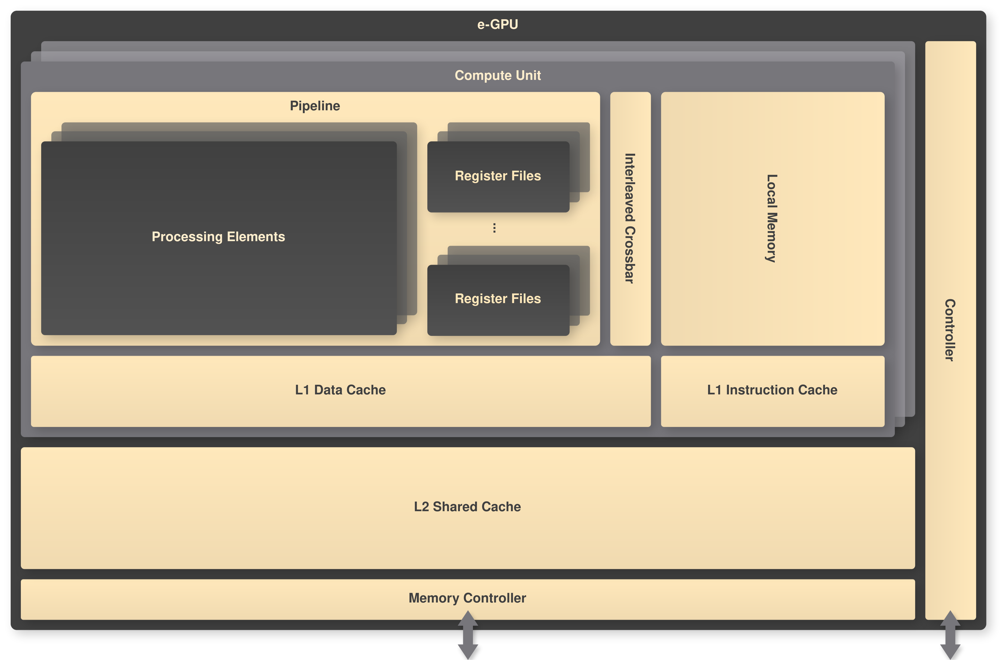

# e-GPU: embedded Graphic Processing Unit

An Open-Source, Configurable and RISC-V-based embedded Graphics Processing Unit (e-GPU) for Ultra-Low-Power Edge Devices.

## Architecture

The schematic is shown below:

<p align="center"></p>

## Getting started

Clone the repository:

```
git clone https://github.com/simone-machetti/e-gpu.git
```

Compile a sample application with a RISC-V toolchain:

```
make APP_NAME=<app_name> all
```

Run the compiled sample application with Modelsim:

```
make SIM_GUI=0 APP_NAME=<app_name> sim
```

**NOTE**: Set `SIM_GUI=1` to open the Modelsim GUI.

Our sample applications are:

- **vec_add**: Computes the element-wise addition of two vectors.
- **vec_mul**: Computes the element-wise multiplication of two vectors.
